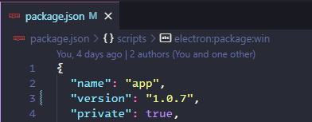
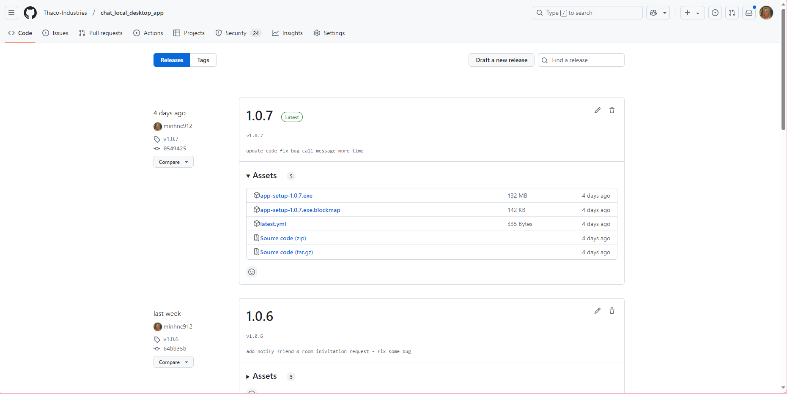
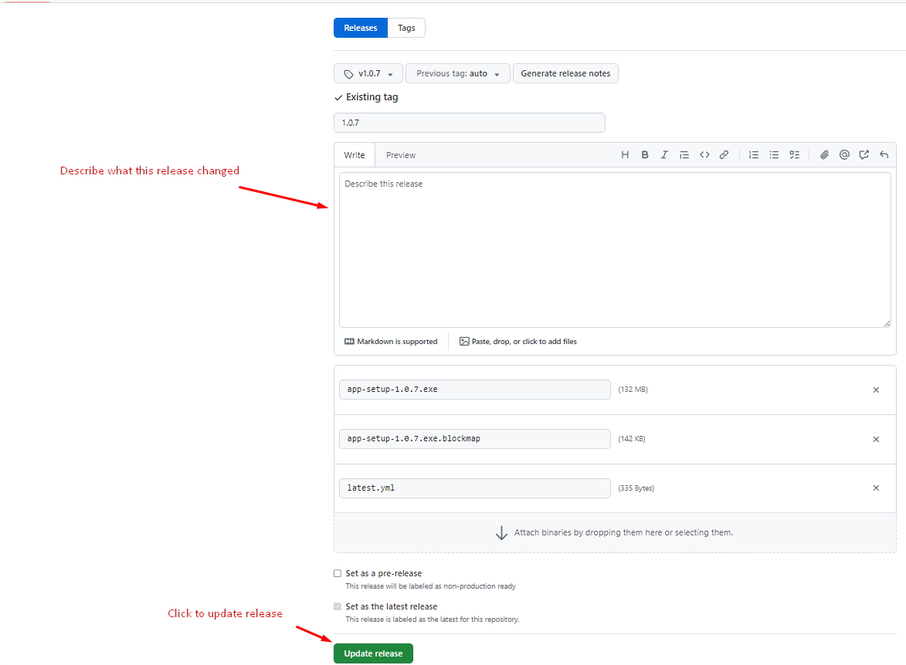

## Getting started

Let's get some easy things out of the way first. The very first thing you'll want to do when using this template is to change the name and appropriate data to point to you and your repo. To make it as easy as possible, all app-specific data is kept in `package.json` and this README. You will want to set all appropriate properties in the `package.json` file, such as `name`, `productName`, `appId`, `repository`, `author`, etc.

## Available Scripts

In the project directory, you can run:

### `npm run electron:start`

Runs the app in the development mode.\

The app will reload if you make edits.\

## UI Framework

This project includes [TailwindCss](https://tailwindcss.com/), [Flowbite](https://flowbite.com/)

## CICD build

Should change version in `package.json` before run command

### `npm run electron:package:win`

Builds the app for production to the `dist` folder.\

After run the build command, we got the setup app with current version inside `dist` folder, ex: `Chat Local R&D Setup 1.0.0.exe`

After run build command, we will got new Releases verion on [https://github.com/Thaco-Industries/chat_local_desktop_app/releases](https://github.com/Thaco-Industries/chat_local_desktop_app/releases).

Then we need to change Latest Release version to update new version on release app:

1. Click `Edit button` on any version want to release at `Releases` tab
   
2. In detail, we can describe for this release, change config & press `Update release` to Release version
   
